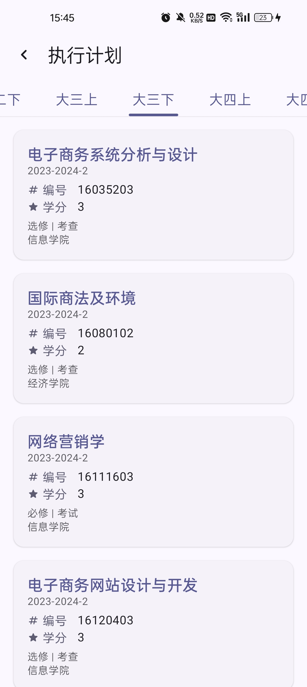
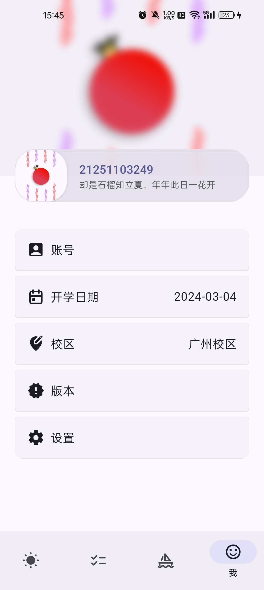
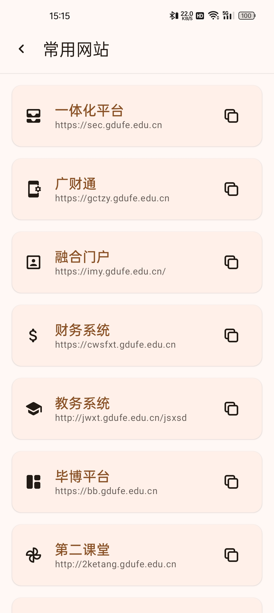

# 广东财经大学小石榴（Punica）

    

## 概览 🍥

Punica 致力于打造更加 **完备**、**安全** 的 **广财教务系统工具**。

将近两年的尝试，我们有理由说这是一款 **现代化**、**便捷** 的教务系统工具。

我们不是数据的创造者，一直以来我们都是与官方服务器 **直连**（尽管官方可能不太乐意）。
我们希望用户能更加安心地使用 Punica，而不需要承担附加风险。

## 截屏

## 为什么选择 Punica 🎡

### ✨ 近乎全量功能复刻

您所能见到的大部分教务系统功能已经打包进 Punica。

### 🧣 更加舒适的操作体验

Punica 优化了原本繁复的操作。

- 使用开源 OCR 库跳过验证码，这也给我们带来了自动登录的支持。
- 支持一键教评。
- 使用 Android 原生开发，UI 遵循 Material Design。

### 🔥 本地持久化数据

Punica 支持数据本地化，断网也能正常使用。

## 支持 🦢
我们的项目开发没有任何启动资金，全靠爱发电，我们需要一些反馈来维持项目的运营。

- 如果 Punica 博得了您的喜欢，请为 Punica 点个 🌟（右上角）。
- 如果您在使用过程中遇到了问题，请发送 [issues](https://github.com/Kiteio/Punica/issues)。
- 如果有条件的话，可以[为我充电](https://afdian.com/a/kiteio)（无自动续费）。