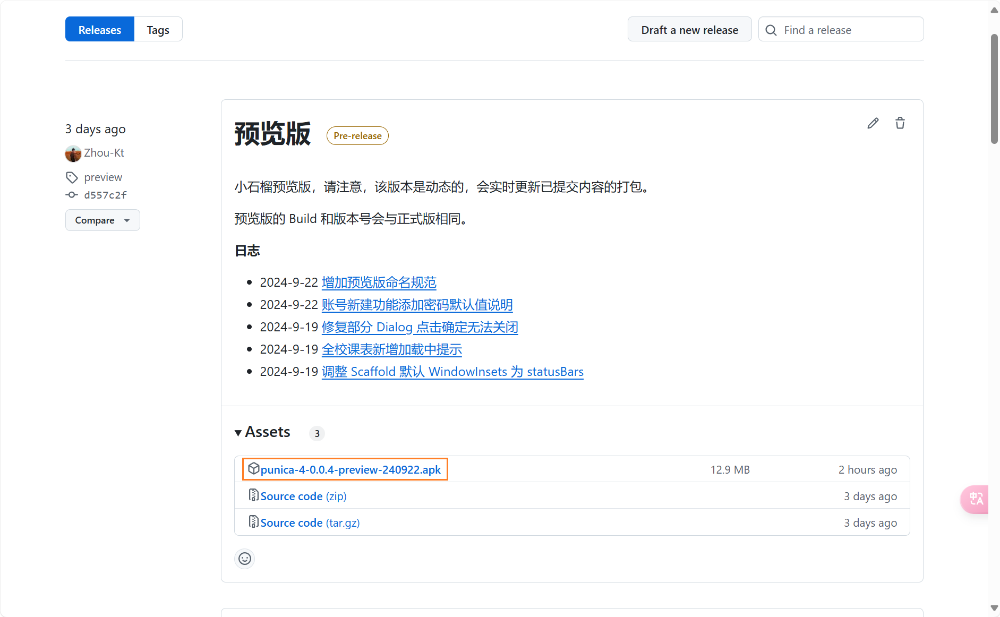
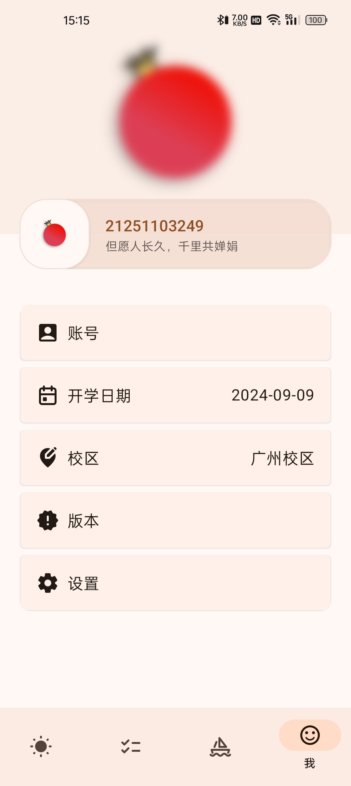
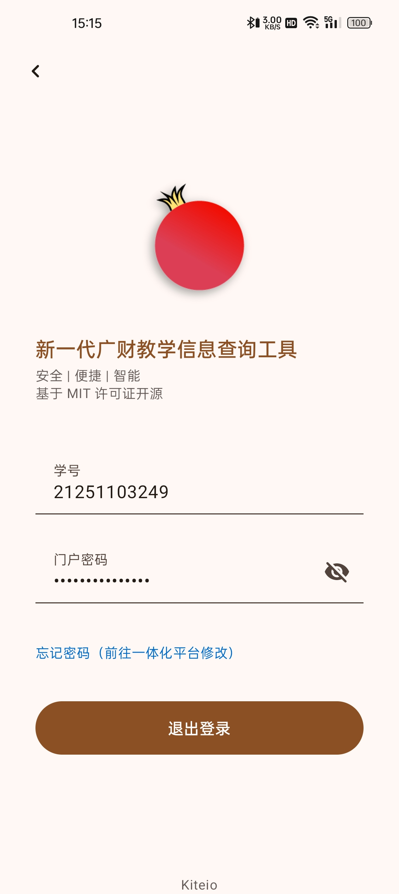
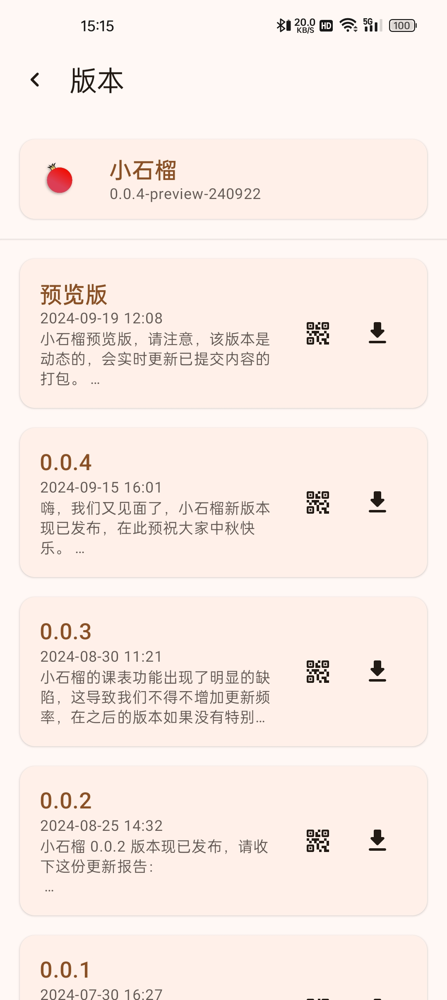
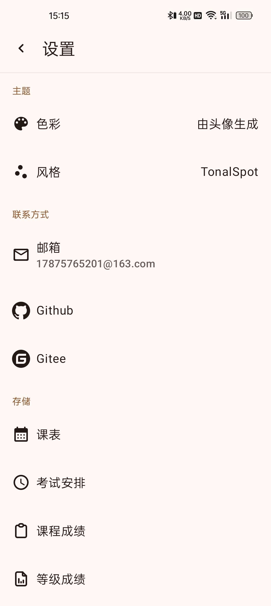

# 小石榴 广财教务系统直连工具

    

## 简介 🕊️

小石榴是一款 **非官方** 的开源教务系统直连工具，它整合了教务系统、教务处通知、第二课堂等功能。

我们基于 Android 原生 Material Design 设计了小石榴，我们希望它足够好用、简单且安全。
我们引入了本地 OCR [tesseract](https://github.com/tesseract-ocr/tesseract) 用于教务系统登录时自动识别验证码，在启动时小石榴会自动登录最后一次登录的账号，您无需手动同步任何数据。
您的账号信息会借助 [DataStore](https://developer.android.google.cn/topic/libraries/architecture/datastore?hl=zh-cn) 存储于本地，且不会有其他服务器插手您与官方服务器的数据传输。

当然，目前小石榴部分功能仍需优化，例如教学评价、选课系统。
此外，小石榴目前只支持通过连接校园网、Motion Pro 才能正常连接教务系统、第二课堂。

## 开始使用 ⛄
小石榴支持 Android 10+ 的设备，您可以到我们的[发行版](https://github.com/Kiteio/Punica/releases)中下载安装包，我们强烈推荐您使用最新版，避免不必要的异常。

这里我们收集了一些已知的影响使用的 Bug，并列出已修复的最低版本。

| 描述                                                                          |                            已修复版本                             |
|-----------------------------------------------------------------------------|:------------------------------------------------------------:|
| 课表顶部日期错误（只存在于 [0.0.3](https://github.com/Kiteio/Punica/releases/tag/0.0.3)） | [0.0.4](https://github.com/Kiteio/Punica/releases/tag/0.0.4) |
| 教学评价无法使用                                                                    | [0.0.4](https://github.com/Kiteio/Punica/releases/tag/0.0.4) |
| 课表学期更新会晚一个月（9月份仍为旧学期）                                                       | [0.0.3](https://github.com/Kiteio/Punica/releases/tag/0.0.3) |
| 选课选中第二志愿仍为第一志愿                                                              | [0.0.3](https://github.com/Kiteio/Punica/releases/tag/0.0.3) |
| 开学日期无法正常设置                                                                  | [0.0.2](https://github.com/Kiteio/Punica/releases/tag/0.0.2) |

## 支持 🐻‍❄️
我们利用宝贵的课余时间制作小石榴，如果您喜欢我们的作品，可以点亮小石榴的仓库的星标，这对我们很重要。

您也可以向我们发起[捐赠](https://afdian.com/a/kiteio)（请选择最低的款项5元/月）。

所有的支持都将用来：提升我们的积极性，延长小石榴的存活时间。

**致谢**

## 截图 🐈‍⬛

    
    
    
    
    

    
    
    
    
    

    
    
    
    
    

