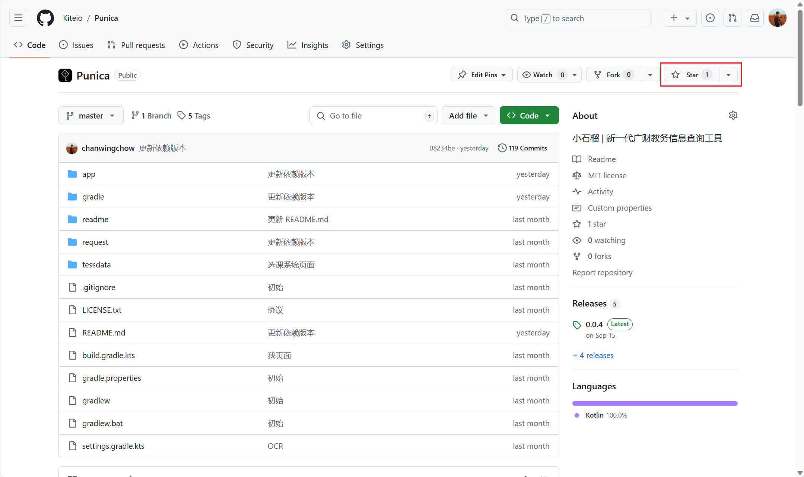
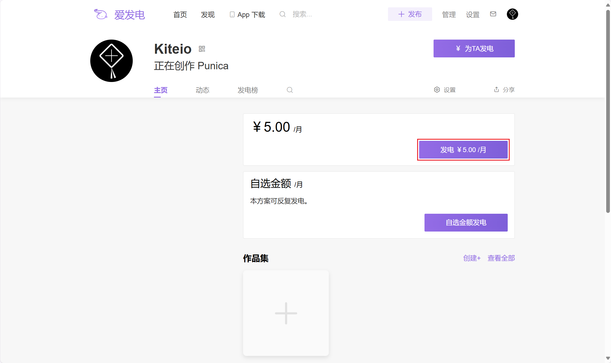

# 小石榴

    

    <i>爱一个人需要理由吗？不需要吗？需要吗？</i>

很高兴见到您！ 
小石榴是一款开源、功能丰富的广东财经大学教学信息查询工具。

## 为什么选小石榴 🐻‍❄️

- 小石榴运用设计语言 [Material Design](https://m3.material.io/)，予你简洁的 UI 界面
- 小石榴配备图像识别用于教务系统登录，一次登录即可享自动数据同步
- 小石榴的教学信息都在您的设备上获取和存储，您无需担心个人信息被存于他人服务器

## 下载 ⛄

小石榴支持 Android 10+ 的手机，请根据您当前使用的平台进入对应的版本列表，展开最新版本中的 **Assets**（Gitee 为**下载**），并点击下载第一项 **punica-x-x.x.x.apk**。

- [GitHub](https://github.com/Kiteio/Punica/releases)
- [Gitee](https://gitee.com/Kiteio/Punica/releases)

## 截图 🐈‍⬛

### 亮色

    
    
    
    

### 暗色

    
    
    
    

## 支持 🕊️

我们利用宝贵的课余时间制作小石榴，如果您喜欢我们的作品，可以点亮星标，这对我们很重要。

您也可以向我们发起[捐赠](https://afdian.com/a/kiteio)（该平台并不会自动续费）。

所有的支持都将用来：提升我们的积极性，延长小石榴的存活时间。

### 致谢

迄今为止我们共收到 **0** 元捐赠。

感谢以下小伙伴点亮星标：

