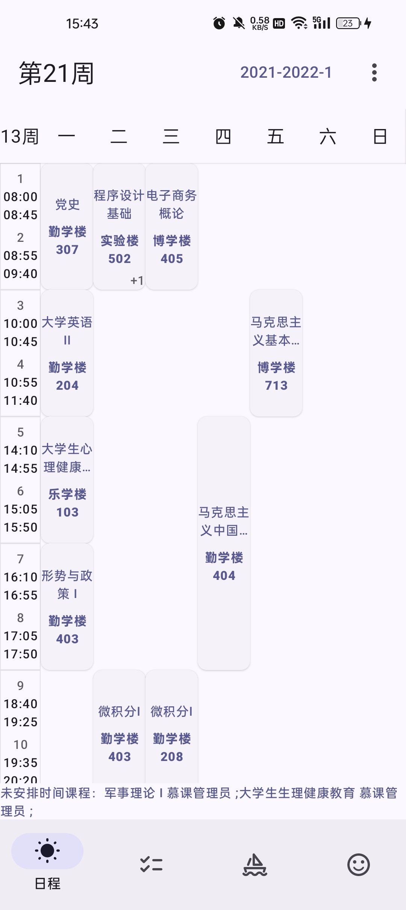
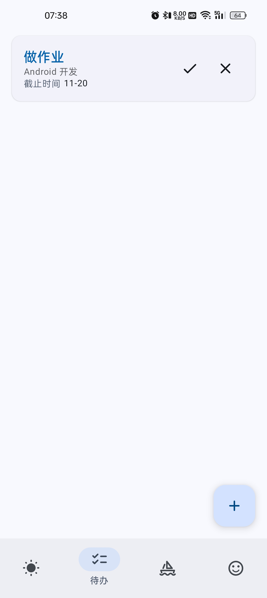
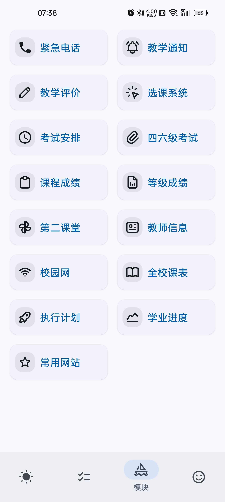
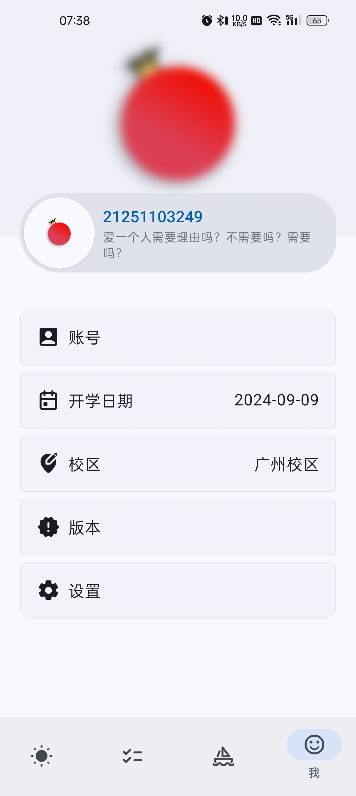
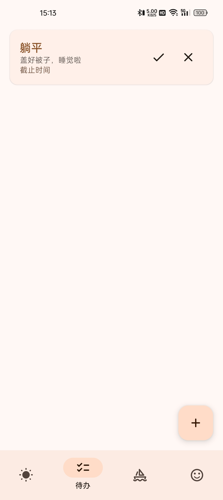
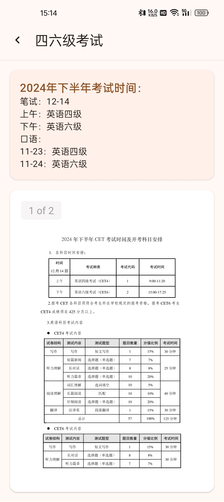
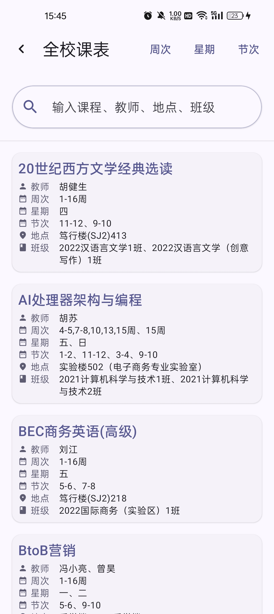

# 小石榴

## 该仓库已不再维护

如需获取最新支持，请前往[Punica-CMP（小石榴跨平台版本）](https://github.com/Kiteio/Punica-CMP)。

    

    <i>爱一个人需要理由吗？不需要吗？需要吗？</i>

很高兴见到你！\
小石榴是一款开源、功能丰富的广东财经大学教学信息查询工具。

小石榴大部分功能的数据来自广财教务系统官方接口，你可以在小石榴中使用以下功能：

- 个人、全选课表
- 选课 | 第二课堂活动、成绩 | 考试安排 | 课程、等级考试成绩
- 执行计划 | 学业进度
- 广财常用网站
- 校园网登录
- 紧急电话
- 教学通知
- 教师信息

## 截图 🐈‍⬛

### 亮色

    
    
    
    

### 暗色

    
    
    
    

