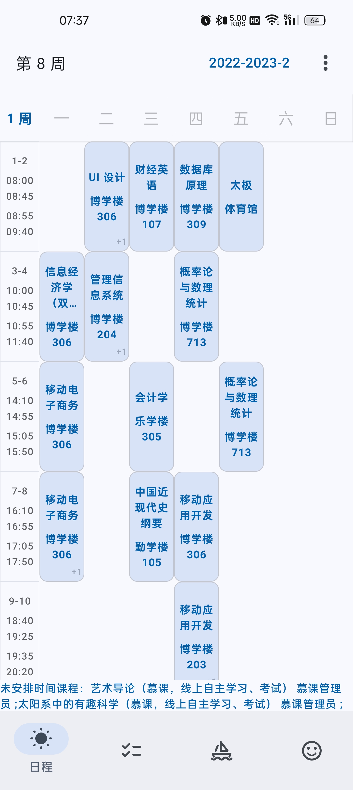
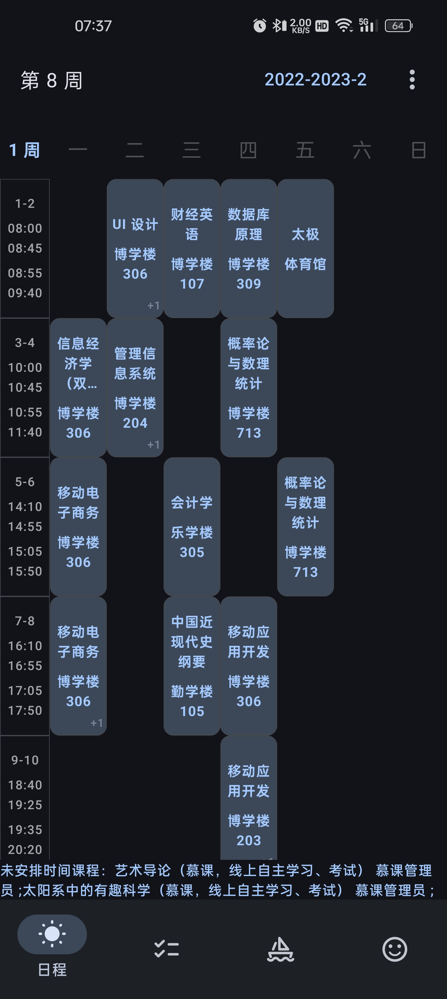

# 小石榴

### 领先的广东财经大学教务系统工具 | 自动登录 | 全量开源

    

    <i>爱一个人需要理由吗？不需要吗？需要吗？</i>

> ### 近期计划
> 我们将对小石榴的代码做全量重审（Code Review），并在不久的将来将其版本提升至`1.0.0`。
> 请注意，该版本可能会与旧版本产生数据兼容性问题，旧版本将在新版本发布不久后失去支持。
>
> 我们会将注意力集中在：
> 1. 新增课表桌面小组件
> 2. 性能优化、代码逻辑检查
> 3. 操作体验提升

很高兴见到你！\
小石榴是一款开源、功能丰富的广东财经大学教学信息查询工具。

小石榴大部分功能的数据来自广财教务系统官方接口，你可以在小石榴中使用以下功能：

- 个人、全选课表
- 选课 | 第二课堂活动、成绩 | 考试安排 | 课程、等级考试成绩
- 执行计划 | 学业进度
- 广财常用网站
- 校园网登录
- 紧急电话
- 教学通知
- 教师信息

## 下载 ⛄

小石榴支持搭载 Android 10+ 的手机，你需要进入[版本列表](https://github.com/Kiteio/Punica/releases)，展开最新版本中的 **Assets**，并点击下载`.apk`文件。

## 截图 🐈‍⬛

### 亮色

    
    
    
    

### 暗色

    
    
    
    

## 支持 🕊️

我们利用宝贵的课余时间制作小石榴，如果你喜欢我们的作品，可以点亮星标，这对小石榴的发展很重要。
你也可以向我们发起[捐赠](https://afdian.com/a/kiteio)（该平台并不会自动续费）。