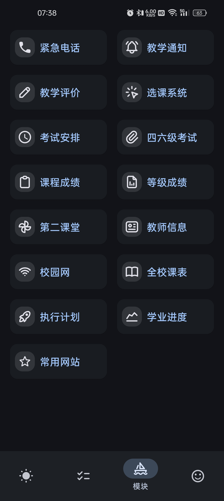

# 广东财经大学小石榴（Punica）

    

## 概览 🍥

小石榴致力于打造更加 **完备**、**安全** 的 **广财教务系统工具**。

将近两年的尝试，我们有理由说这是一款 **现代化**、**便捷** 的教务系统工具。

我们不是数据的创造者，一直以来我们都是与官方服务器 **直连**（尽管官方可能不太乐意）。
我们希望用户能更加安心地使用小石榴，而不需要承担附加风险。

## 恶性 Bug 集合 📌
这里我们会收集一些已知的影响使用的 Bug，并列出已修复的最低版本，我们强烈推荐您升级至最新版以规避恶性 Bug。

| 描述                                                                          |                            已修复版本                             |
|-----------------------------------------------------------------------------|:------------------------------------------------------------:|
| 课表顶部日期错误（只存在于 [0.0.3](https://github.com/Kiteio/Punica/releases/tag/0.0.3)） |                          0.0.4（未发布）                          |
| 评教无法使用                                                                      |                          0.0.4（未发布）                          |
| 课表学期更新会晚一个月（9月份仍为旧学期）                                                       | [0.0.3](https://github.com/Kiteio/Punica/releases/tag/0.0.3) |
| 选课选中第二志愿仍为第一志愿                                                              | [0.0.3](https://github.com/Kiteio/Punica/releases/tag/0.0.3) |
| 开学日期无法正常设置                                                                  | [0.0.2](https://github.com/Kiteio/Punica/releases/tag/0.0.2) |

## 截屏 ✂️

## 为什么选择小石榴 🎡

### ✨ 近乎全量功能复刻

您所能见到的大部分教务系统功能已经打包进小石榴。

### 🧣 更加舒适的操作体验

小石榴优化了原本繁复的操作。

- 使用开源 OCR 库跳过验证码，这也给我们带来了自动登录的支持。
- 支持一键教评。
- 使用 Android 原生开发，UI 遵循 Material Design。

### 🔥 本地持久化数据

小石榴支持数据本地化，断网也能正常使用。

## 支持 🦢

我们的项目开发没有任何启动资金，全靠爱发电，我们需要一些反馈来维持项目的运营。

- 如果小石榴博得了您的喜欢，请为小石榴点亮 🌟（右上角）。
- 如果您在使用过程中遇到了问题，请发送 [issues](https://github.com/Kiteio/Punica/issues)。
- 如果有条件的话，可以[为我充电](https://afdian.com/a/kiteio)（无自动续费）。